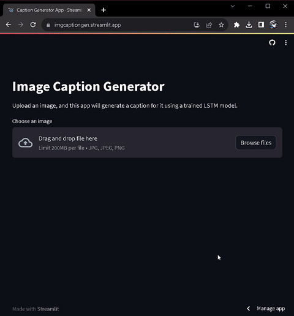

# **Image Caption Generator using Deep Learning**

[](https://github.com/apekshachandak1/image_caption_generator/blob/main/LICENSE)
[](https://www.python.org/)
[](https://www.tensorflow.org/)


[](https://www.streamlit.io/)

---

## **Table of Contents**

- [Demo](#demo)
- [Overview](#overview)
- [About the Dataset](#about-the-dataset)
- [Installation](#installation)
- [Deployment on Streamlit](#deployment-on-streamlit)
- [Directory Tree](#directory-tree)
- [Future Scope](#future-scope)
- [Author](#author)

---

## **Demo**

- **App Link**: [Image Caption Generator](https://your-streamlit-app-link)

> **Note**: If the app link does not work, it may be offline or there may be technical issues. Apologies for any inconvenience.

### **Quick Preview**



---

## **Overview**

The **Image Caption Generator** is a deep learning-based project designed to automatically generate meaningful captions for images. The system employs **MobileNetV2** for efficient image feature extraction and a custom **LSTM-based architecture** with an attention mechanism for caption generation.

### **Key Features**
- **Feature Extraction**: Leverages MobileNetV2 for memory-efficient image feature extraction.
- **Caption Generation**: Implements a custom LSTM-based architecture with an attention mechanism for generating high-quality captions.
- **Interactive App**: Deployed using Streamlit, allowing users to upload and caption images in real time.

---

## **About the Dataset**

This project uses the [Flickr8k dataset](https://www.kaggle.com/adityajn105/flickr8k), which contains:

- **8,091 images** with diverse content.
- Each image is paired with **five captions** that describe the content in different ways.

### **Dataset Directory Structure**
```
flickr8k/
    ├── Images/
    │     ├── (image files)
    ├── captions.txt
```

To use the dataset, download it from the provided [Kaggle link](https://www.kaggle.com/adityajn105/flickr8k) and organize the files as shown above.

---

## **Installation**

### **Prerequisites**
- Python 3.10 or higher is required.
- Install all dependencies from the `requirements.txt` file.

### **Steps to Install**
1. Clone the repository:
   ```bash
   git clone https://github.com/apekshachandak1/image_caption_generator.git
   cd image_caption_generator
   ```

2. Install the required dependencies:
   ```bash
   pip install -r requirements.txt
   ```

3. Run the app:
   ```bash
   streamlit run app.py
   ```

---

## **Deployment on Streamlit**

To deploy this app on Streamlit:

1. Create an account on [Streamlit Sharing](https://streamlit.io/).
2. Fork this repository to your GitHub account.
3. Log in to Streamlit and create a new app.
4. Configure the app:
   ```
   [server]
   headless = true
   port = $PORT
   enableCORS = false
   ```
5. Deploy the app by linking the repository and clicking **Deploy App**.

---

## **Directory Tree**

```
image_caption_generator/
    ├── app.py
    ├── image-captioner.ipynb
    ├── requirements.txt
    ├── LICENSE
    ├── tokenizer.pkl
    ├── mymodel.h5
    └── resource/
        └── demo.gif
```

---

## **Future Scope**

1. **Beam Search Decoding**:
   - Implement beam search for generating multiple captions and selecting the best one.
   
2. **Multilingual Support**:
   - Extend the model to support caption generation in multiple languages using multilingual datasets.
   
3. **UI Improvements**:
   - Enhance the Streamlit app by adding features like caption confidence scores and image previews.
   
4. **Dataset Expansion**:
   - Train the model on larger datasets like [Flickr30k](https://www.kaggle.com/datasets/hsankesara/flickr-image-dataset) to improve caption diversity and complexity.

5. **Model Optimization**:
   - Explore other feature extraction models like **EfficientNet** for better performance-to-resource trade-offs.

---

## **Author**

Developed with ❤️ by **[Apeksha Chandak](https://www.linkedin.com/in/apeksha-chandak/)**.

Feel free to connect or reach out for collaboration opportunities!
